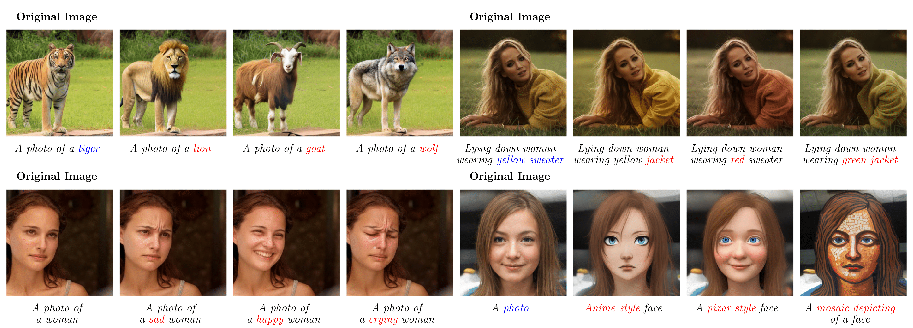
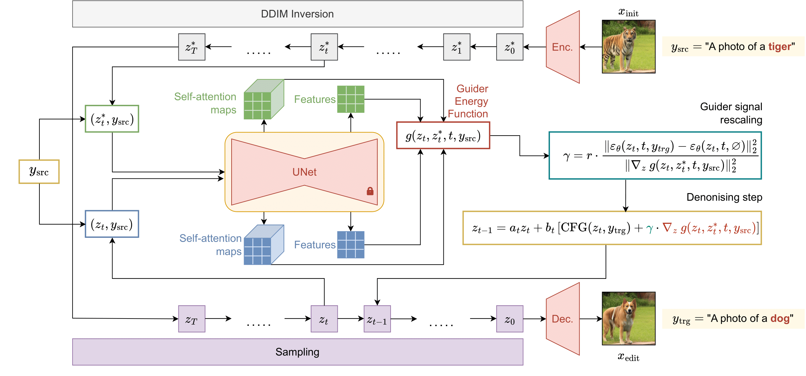

# Guide-and-Rescale: Self-Guidance Mechanism for Effective Tuning-Free Real Image Editing (ECCV 2024)

<a href=""></a>
<a href="https://huggingface.co/spaces/AIRI-Institute/Guide-and-Rescale"></a>
<a href="https://colab.research.google.com/drive/1noKOOcDBBL_m5_UqU15jBBqiM8piLZ1O?usp=sharing"></a>
[](./LICENSE)

>Despite recent advances in large-scale text-to-image generative models, manipulating real images with these models remains a challenging problem. The main limitations of existing editing methods are that they either fail to perform with consistent quality on a wide range of image edits, or require time-consuming hyperparameter tuning or fine-tuning of the diffusion model to preserve the image-specific appearance of the input image. Most of these approaches utilize source image information via intermediate feature caching which is inserted in generation process as itself. However, such technique produce feature misalignment of the model that leads to inconsistent results. 
We propose a novel approach that is built upon modified diffusion sampling process via guidance mechanism. In this work, we explore self-guidance technique to preserve the overall structure of the input image and its local regions appearance that should not be edited. In particular, we explicitly introduce layout preserving energy functions that are aimed to save local and global structures of the source image. Additionally, we propose a noise rescaling mechanism that allows to preserve noise distribution by balancing the norms of classifier-free guidance and our proposed guiders during generation. It leads to more consistent and better editing results. Such guiding approach does not require fine-tuning diffusion model and exact inversion process. As a result, the proposed method provides a fast and high quality editing mechanism.
In our experiments, we show through human evaluation and quantitative analysis that the proposed method allows to produce desired editing which is more preferable by the human and also achieves a better trade-off between editing quality and preservation of the original image.
>



## Setup

This code uses a pre-trained [Stable Diffusion](https://huggingface.co/docs/diffusers/v0.25.1/en/api/pipelines/stable_diffusion/text2img#diffusers.StableDiffusionPipeline) from [Diffusers](https://github.com/huggingface/diffusers#readme) library. We ran our code with Python 3.8.5, PyTorch 2.3.0, Diffuser 0.17.1 on NVIDIA A100 GPU with 40GB RAM.

In order to setup the environment, run:
```
conda env create -f sd_env.yaml
```
Conda environment `ldm` will be created and you can use it.


## Quickstart

We provide examples of applying our pipeline to real image editing in Colab <a href="https://colab.research.google.com/drive/1noKOOcDBBL_m5_UqU15jBBqiM8piLZ1O?usp=sharing"></a>. 

You can try Grardio demo in HF Spaces <a href="https://huggingface.co/spaces/AIRI-Institute/Guide-and-Rescale"></a>.

We also provide [a jupyter notebook](example_notebooks/guide_and_rescale.ipynb) to try Guide-and-Rescale pipeline on your own server.

## Method Diagram
<p align="center">
  
  <br>
</p>
<p align="center">
  <br>
    Overall scheme of the proposed method Guide-and-Rescale. First, our method uses a classic ddim inversion of the source real image. Then the method performs real image editing via classical denoising process. For every denoising step the noise term is modified by guider that utilizes latents $z_t$ from current generation process and time-aligned ddim latents $z^*_t$.
</p>


## Guiders

In our work we propose specific **guiders**, i.e. guidance signals suitable for editing. The code for these guiders can be found in [diffusion_core/guiders/opt_guiders.py](diffusion_core/guiders/opt_guiders.py).

Every guider is defined as a separate class, that inherits from the parent class `BaseGuider`. A template for defining a new guider class looks as follows:

```
class SomeGuider(BaseGuider):
    patched: bool
    forward_hooks: list
    
    def [grad_fn or calc_energy](self, data_dict):
        ...

    def model_patch(self, model):
        ...
    
    def single_output_clear(self):
        ...
```

### grad_fn or calc_energy

The `BaseGuider` class contains a property `grad_guider`. This property is `True`, when the guider does not require any backpropagation over its outputs for retrieving the gradient w.r.t. the current latent (for example, as in classifier-free guidance). In this case, the child class contains a function `grad_fn`, where the gradient w.r.t. the current latent is estimated algorithmically.

When the gradient has to be estimated with backpropagation and `grad_guider` is `False` (for example, as when using the norm of the difference of attention maps for guidance), the child class contains a function `calc_energy`, where the desired energy function output is calculated. This output is further used for backpropagation.

The `grad_fn` and `calc_energy` functions receive a dictionary (`data_dict`) as input. In this dictionary we store all objects (the diffusion model instance, prompts, current latent, etc.) that might be usefull for the guiders in the current pipeline.

### model_patch and patched

When the guider requires outputs of intermediate layers of the diffusion model to estimate the energy function/gradient, we define a function `model_patch` in this guider's class and set property `patched` equal `True`. We will further refer to such guiders as *patched guiders*.

This function patches the desired layers of the diffusion model, an retrieves the necesarry output from these layers. This output is then stored in the property `output` of the guider class object. This way it can be accessed by the editing pipeline an stored in `data_dict` for further use in `calc_energy`/`grad_fn` functions.

### forward_hooks

In the editing pipeline we conduct 4 diffusion model forward passes:

- unconditional, from the current latent $z_t$
- `cur_inv`: conditional on the initial prompt, from the current latent $z_t$
- `inv_inv`: conditional on the initial prompt, from the corresponding inversion latent $z^*_t$
- `cur_trg`: conditional on the prompt describing the editing result, from the current latent $z_t$

We store the unconditional prediction in `data_dict`, as well as the ouputs of `cur_inv` and `cur_trg` forward passes for further use in classifier-free guidance.

However, when the guider is patched, we also have its `output` to store in `data_dict`. In `forward_hooks` property of the guider class we define the list of forward passes (from the range: `cur_inv`, `inv_inv`, `cur_trg`), for which we need to store the `output`. 

After the specific forward pass is conducted we can access the `output` of the guider and store it in `data_dict`, if the forward pass is listed in `forward_hooks`. We store it with a key, specifying the current forward pass.

This way we can avoid storing unnecesary `output`s in `data_dict`, as well as distinguish `output`s from different forward passes by their keys.


### single_output_clear

This is only relevant for patched guiders.

When the data from the `output` property of the guiders class object is stored in `data_dict`, we need to empty the `output` to avoid exceeding memory limit. For this purpose we define a `single_output_clear` function. It returns an empty `output`, for example `None`, or an empty list `[]`.

## References & Acknowledgments

The repository was started from [Prompt-to-Prompt](https://github.com/google/prompt-to-prompt/). 
